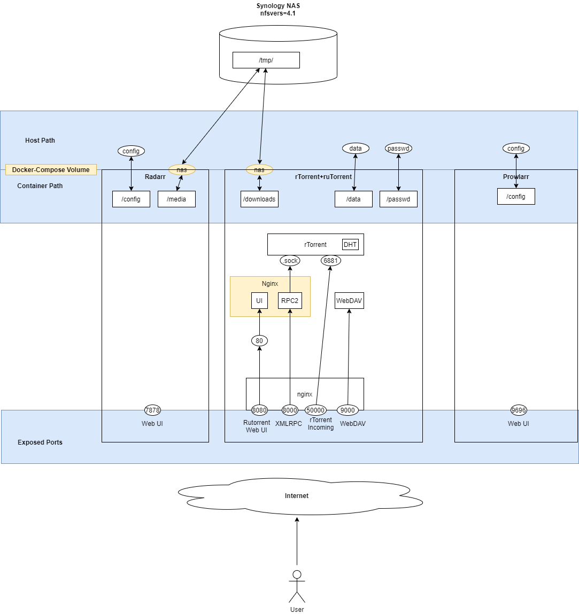

# Quick Setup

This will deploy Radarr, Prowlarr, rTorrent+ruTorrent and mount a NAS volume.

## Configuration

Change `PUID` and `PGID` to match your current user ID where you run the script. Docker will attempt to write files using this account. 

Run `id` to see your current user ID

### Radarr

# EOF
